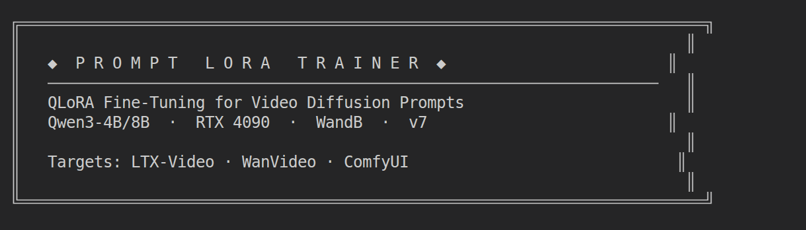

# prompt-lora-trainer 🤖 ⚡ 🎑

<p align="center">
  
</p>

QLoRA fine-tuning pipeline for training Qwen3-4B to generate cinematic video diffusion prompts. Specializes in the **De Forum Art Film** aesthetic — noir-influenced, atmospheric, psychologically minimal.

## Published Models

| Model | Dataset | Status |
|-------|---------|--------|
| [qwen3-4b-deforum-prompt-lora-v7](https://huggingface.co/Limbicnation/qwen3-4b-deforum-prompt-lora-v7) | deforum-v7 (1,547 rows) | ✅ Latest |
| [qwen3-4b-deforum-prompt-lora-v2](https://huggingface.co/Limbicnation/qwen3-4b-deforum-prompt-lora-v2) | deforum-v2 | ⚠️ Overfits |
| [qwen3-4b-prompt-lora](https://huggingface.co/Limbicnation/qwen3-4b-prompt-lora) | Video-Diffusion-Prompt-Style | ✅ v1 |

## Datasets

| Dataset | Rows | Notes |
|---------|------|-------|
| [deforum-prompt-lora-dataset-v7](https://huggingface.co/datasets/Limbicnation/deforum-prompt-lora-dataset-v7) | 1,547 train / 172 val | Decoupled instruction/synthesis, packing=false |
| [deforum-prompt-lora-dataset-v2](https://huggingface.co/datasets/Limbicnation/deforum-prompt-lora-dataset-v2) | ~2,000 | Tier-based, reformatted |
| [Video-Diffusion-Prompt-Style](https://huggingface.co/datasets/Limbicnation/Video-Diffusion-Prompt-Style) | 752 | Original general video prompts |

## Quick Start

```bash
# 1. Create environment (conda required — .venv-train has CUBLAS issues on cu128)
conda create -n prompt-lora-trainer python=3.10 -y
conda activate prompt-lora-trainer

# 2. Install PyTorch (CUDA 12.4)
pip install torch torchvision torchaudio --index-url https://download.pytorch.org/whl/cu124

# 3. Install training deps via uv
pip install uv
uv sync

# 4. Build dataset (dry-run first)
conda run -n prompt-lora-trainer uv run scripts/build_dataset_v7.py --dry-run
conda run -n prompt-lora-trainer uv run scripts/build_dataset_v7.py

# 5. Train
conda run -n prompt-lora-trainer python scripts/train_sft.py \
  --config configs/sft_qwen3_4b_deforum_v7.yaml

# 6. Export: merge → GGUF → Ollama → HF Hub
./convert_and_upload.sh
```

## 📁 Structure

```
├── configs/
│   ├── sft_qwen3_4b_deforum_v7.yaml    # Active: v7 training config
│   ├── sft_qwen3_4b_deforum.yaml       # v1 deforum config (reference)
│   └── sft_qwen3_4b.yaml               # v1 original config (reference)
├── scripts/
│   ├── train_sft.py                    # Main SFT script (QLoRA + early stopping)
│   ├── build_dataset_v7.py             # Dataset builder (current)
│   ├── merge_and_convert_gguf.py       # LoRA merge + GGUF conversion
│   └── validate_dataset.py             # Dataset format validator
├── Modelfile.deforum-v7                # Ollama model definition (v7, with auto-prefix template)
├── Modelfile.deforum-v6                # Ollama model definition (v6)
├── convert_and_upload.sh               # Full export pipeline
└── pyproject.toml                      # Dependencies (uv)
```

## ⚙️ Training Config (v7)

| Parameter | Value |
|-----------|-------|
| Base Model | Qwen3-4B-Instruct-2507 |
| LoRA r/α | 32/64 |
| Target modules | q/k/v/o_proj + gate/up/down_proj |
| Quantization | 4-bit NF4 + double quant (QLoRA, bf16 compute) |
| Batch | 4 × 2 gradient accum (8 effective) |
| LR | 1e-4 (cosine_with_min_lr, min 1e-6) |
| Epochs | 5 (best at epoch 2, early stopping patience=3) |
| Packing | false (prevents cross-example contamination) |
| Eval | Per epoch |

## Ollama Deployment

After GGUF export:

```bash
# Create Ollama model
ollama create qwen3-4b-deforum-prompt:v7 -f Modelfile.deforum-v7

# Run — bare scene descriptions work directly
ollama run qwen3-4b-deforum-prompt:v7 "Sarah at her studio late at night, surrounded by subversive artwork"
# → Slow dolly in on Sarah's studio at night, chiaroscuro lighting etching her silhouette
#   against a backdrop of subversive artwork. Heavy film grain, the air thick with unspoken rebellion.
```

> The Modelfile uses a `TEMPLATE` that auto-prepends `"Generate a cinematic video prompt for: "` to every user message, matching the training format without requiring the user to type it.

## Known Issues

- `extra_special_tokens` serialization bug: `convert_and_upload.sh` deletes the field at merge time
- Use conda env, not `.venv-train` — the latter has torch 2.10+cu128 which causes CUBLAS errors on this driver
- Small datasets overfit fast; always use eval split + early stopping (already in v7 config)
- Qwen3 thinking mode: pass `enable_thinking=False` in `apply_chat_template()` for direct output
